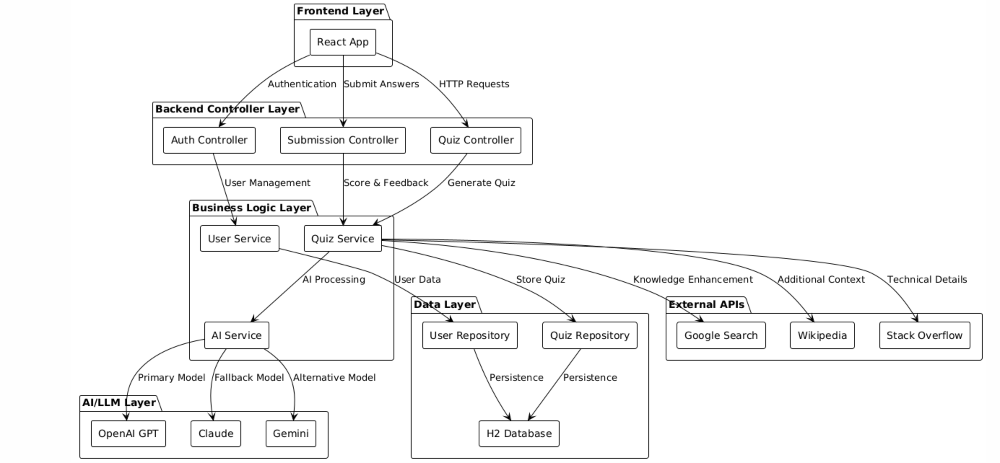
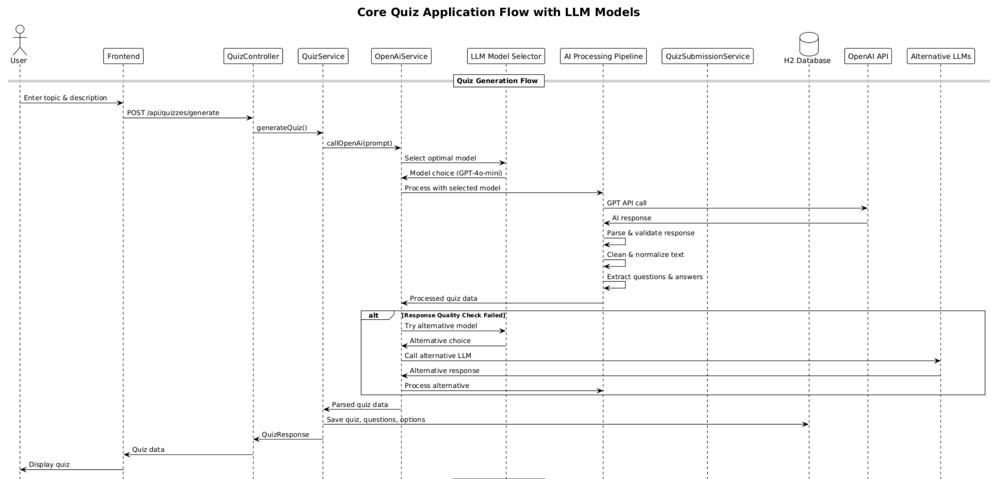
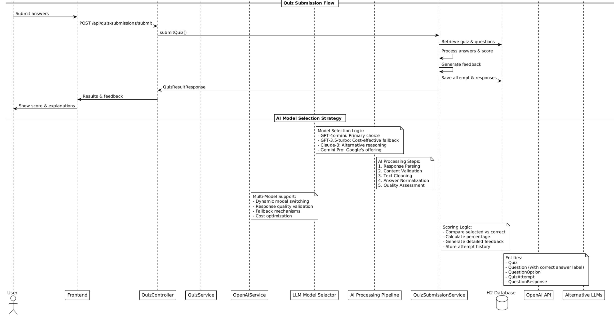

# Quiz Backend Architecture Documentation

This document provides comprehensive architecture diagrams and explanations for the AI-Powered Quiz Backend application.

## Architecture Overview

The application follows a **layered architecture pattern** with clear separation of concerns and a sophisticated **AI/LLM integration layer**:

1. **API Gateway Layer** - REST Controllers
2. **AI/LLM Service Layer** - AI Models, Prompt Engineering, and Response Processing
3. **Business Logic Layer** - Core Business Services
4. **Data Access Layer** - Repository Pattern
5. **Data Layer** - JPA Entities & Database
6. **External Knowledge APIs** - OpenAI, Google, Stack Overflow, Wikipedia

## Architecture Diagrams

### 1. System Architecture

**Purpose**: Complete system overview showing all components, LLM models, and their relationships

**Key Components**:
- **Frontend/Client Layer**: Web apps, mobile apps, API clients
- **API Gateway Layer**: REST controllers with CORS support
- **AI/LLM Service Layer**: AI models, prompt engineering, response processing
- **Business Logic Layer**: Core business services
- **Data Access Layer**: Repository interfaces for data persistence
- **Data Layer**: H2 database with JPA entities
- **LLM Models & AI Services**: Multiple AI models with fallback strategies
- **External Knowledge APIs**: OpenAI GPT, Google Search, Stack Overflow, Wikipedia

**Use Case**: System design reviews, onboarding new developers, understanding the complete AI architecture



### 2. Core Flow Architecture

**Purpose**: Focused view of the main quiz generation and submission flows with AI processing

**Key Flows**:
- **Quiz Generation Flow**: Topic input → AI model selection → LLM processing → Database storage → Response
- **Quiz Submission Flow**: Answer submission → Scoring → Feedback generation → Results
- **AI Model Selection Strategy**: Dynamic model selection with fallback mechanisms

**Use Case**: Understanding the main user journeys, debugging core functionality, AI processing flow







## AI/LLM Architecture Deep Dive

### 1. **Multi-Model AI Integration**
The system supports multiple LLM models for enhanced reliability and cost optimization:

- **GPT-4o-mini**: Primary model for high-quality quiz generation
- **GPT-3.5-turbo**: Cost-effective fallback for simple topics
- **Claude-3 Haiku**: Alternative reasoning and perspective
- **Gemini Pro**: Google's offering for technical topics
- **Local Models**: On-premise models for data privacy

### 2. **Intelligent Model Selection**
The Model Selector Service automatically chooses the optimal model based on:

- **Cost Optimization**: Balance between quality and cost
- **Performance Metrics**: Response time and success rate
- **Topic Complexity**: Simple vs. complex subject matter
- **Quality Requirements**: Minimum quality thresholds
- **Fallback Strategy**: Automatic model switching on failure

### 3. **AI Processing Pipeline**
Sophisticated processing ensures high-quality output:

1. **Prompt Engineering**: Dynamic prompt generation based on topic, difficulty, and context
2. **Response Parsing**: Structured parsing of AI responses
3. **Content Validation**: Quality checks for question clarity and answer correctness
4. **Text Cleaning**: Removal of escape characters, emojis, and unwanted formatting
5. **Quality Assessment**: Multi-factor quality scoring with automatic fallback

### 4. **Knowledge Enhancement**
Integration with external knowledge sources:

- **Google Search**: Real-time web information
- **Stack Overflow**: Technical Q&A data
- **Wikipedia**: Comprehensive knowledge base
- **Custom Knowledge Base**: Domain-specific information

## How to Generate Diagrams

### Prerequisites
- Install [PlantUML](https://plantuml.com/download)
- Or use online PlantUML editor: [PlantUML Online Server](http://www.plantuml.com/plantuml/uml/)

### Local Generation
```bash
# Install PlantUML (macOS)
brew install plantuml

# Generate PNG from PlantUML files
plantuml -tpng ARCHITECTURE.md
```

### Online Generation
1. Copy the PlantUML code from any diagram section above
2. Paste into [PlantUML Online Server](http://www.plantuml.com/plantuml/uml/)
3. Download the generated image

## Architecture Patterns

### 1. **Layered Architecture**
- Clear separation between presentation, AI processing, business logic, and data layers
- Each layer has a specific responsibility
- Dependencies flow downward (controllers depend on services, not vice versa)

### 2. **AI/LLM Integration Pattern**
- **Model Abstraction**: Unified interface for different LLM providers
- **Fallback Strategy**: Automatic model switching for reliability
- **Quality Assurance**: Multi-stage validation and processing
- **Cost Optimization**: Intelligent model selection based on requirements

### 3. **Repository Pattern**
- Abstracts data access logic
- Provides a clean interface for data operations
- Easy to switch between different data sources

### 4. **Service Layer Pattern**
- Encapsulates business logic and AI processing
- Orchestrates multiple repositories and external services
- Provides transaction management

### 5. **DTO Pattern**
- Separates internal entities from external API contracts
- Prevents over-exposure of internal data structures
- Allows for API versioning and evolution

## Key Design Decisions

### 1. **AI Model Strategy**
- **Primary Model**: GPT-4o-mini for best quality and performance
- **Fallback Models**: Multiple alternatives for reliability
- **Cost Optimization**: Automatic selection based on complexity and budget
- **Quality Assurance**: Multi-stage validation with automatic retry

### 2. **CORS Configuration**
- **QuizController**: `@CrossOrigin(origins = "*")` for quiz management
- **QuizSubmissionController**: No CORS restrictions (configure as needed)
- **Rationale**: Different controllers may have different CORS requirements

### 3. **Text Processing Pipeline**
- **Input Cleaning**: Removes escape characters, emojis, unwanted prefixes
- **Answer Normalization**: Stores correct answers as labels (A/B/C/D) for consistent scoring
- **Quality Validation**: Multi-factor assessment with automatic improvement
- **Rationale**: AI-generated content needs sophisticated cleaning and validation

### 4. **Scoring System**
- **Label-based Comparison**: Compares selected answer labels directly
- **Feedback Generation**: Provides detailed feedback with option text and explanations
- **Quality Metrics**: Tracks question difficulty and user performance
- **Rationale**: Ensures accurate scoring and meaningful user feedback

### 5. **Database Design**
- **In-memory H2**: For development and testing
- **PostgreSQL Ready**: Easy migration path for production
- **AI Metadata**: Stores model information and quality scores
- **Rationale**: Fast development iteration with production scalability

## Data Flow Patterns

### 1. **Quiz Generation Flow**
```
User Input → Controller → Service → AI Model Selection → LLM Processing → Quality Check → Database → Response
```

### 2. **Quiz Submission Flow**
```
User Answers → Controller → Service → Database Query → Scoring → Feedback → Storage → Results
```

### 3. **AI Processing Flow**
```
Topic Input → Prompt Engineering → Model Selection → LLM Call → Response Parsing → Content Validation → Text Cleaning → Quality Assessment → Output Generation
```

### 4. **Model Fallback Flow**
```
Primary Model → Quality Check → Fallback Decision → Alternative Model → Re-processing → Quality Validation → Final Output
```

## Scalability Considerations

### 1. **AI Model Scaling**
- **Model Pooling**: Multiple instances of each model
- **Load Balancing**: Distribute requests across model instances
- **Caching**: Cache common quiz topics and responses
- **Async Processing**: Background quiz generation for complex topics

### 2. **Horizontal Scaling**
- Stateless service layer allows multiple instances
- Database connection pooling for concurrent access
- Load balancer support for multiple backend instances

### 3. **Performance Optimization**
- **AI Response Caching**: Cache high-quality responses
- **Model Performance Tracking**: Monitor and optimize model selection
- **Database Indexing**: Optimize for frequent queries
- **Content Delivery**: CDN for static quiz content

### 4. **External API Management**
- **Rate Limiting**: Intelligent throttling for AI APIs
- **Fallback Mechanisms**: Multiple knowledge sources
- **Response Caching**: Cache external API responses
- **Quality Monitoring**: Track API performance and reliability

## Security Considerations

### 1. **AI Model Security**
- **API Key Management**: Secure storage and rotation
- **Input Validation**: Prevent prompt injection attacks
- **Output Sanitization**: Remove potentially harmful content
- **Model Access Control**: Restrict access to sensitive models

### 2. **API Security**
- Environment variable configuration for sensitive data
- Input validation and sanitization
- CORS configuration for frontend integration
- Rate limiting and abuse prevention

### 3. **Data Security**
- No sensitive data logging
- Prepared statements for database queries
- User authentication and authorization
- Data encryption at rest and in transit

## Monitoring and Observability

### 1. **AI Model Monitoring**
- **Response Quality Metrics**: Track question clarity and answer correctness
- **Model Performance**: Monitor response times and success rates
- **Cost Tracking**: Monitor API usage and costs
- **Quality Trends**: Track improvement over time

### 2. **Logging**
- Structured logging with different levels
- Request/response logging for debugging
- Performance metrics for key operations
- AI model selection and quality metrics

### 3. **Health Checks**
- Database connectivity checks
- External API availability monitoring
- AI model health and performance
- Application health endpoints

## Future Enhancements

### 1. **AI/LLM Improvements**
- **Fine-tuned Models**: Custom models for specific domains
- **Multi-modal Support**: Image and audio quiz generation
- **Real-time Learning**: Improve models based on user feedback
- **Advanced Prompting**: Dynamic prompt optimization

### 2. **Performance**
- Redis caching for quiz data and AI responses
- Async quiz generation with progress tracking
- Database connection pooling optimization
- Content delivery network integration

### 3. **Features**
- **Adaptive Difficulty**: Dynamic question adjustment
- **Personalized Learning**: User-specific quiz recommendations
- **Advanced Analytics**: Detailed performance insights
- **Multi-language Support**: Internationalization

### 4. **Architecture**
- **Event-driven Architecture**: Real-time notifications
- **Microservices Decomposition**: Service isolation
- **GraphQL API Support**: Flexible data querying
- **Kubernetes Deployment**: Container orchestration

## Troubleshooting Architecture Issues

### 1. **AI Model Issues**
- **Model Selection Problems**: Check configuration and fallback logic
- **Quality Degradation**: Monitor quality metrics and model performance
- **API Failures**: Verify API keys and rate limits
- **Response Parsing Errors**: Check prompt engineering and validation

### 2. **CORS Problems**
- Check controller-level CORS annotations
- Verify frontend origin configuration
- Test with different client types
- Review browser console for errors

### 3. **Database Issues**
- Verify entity relationships
- Check JPA mapping annotations
- Review database schema consistency
- Monitor connection pool performance

### 4. **External API Issues**
- Check API key configuration
- Verify rate limiting compliance
- Test API connectivity
- Monitor response quality and reliability

## Conclusion

This architecture provides a solid foundation for the AI-powered quiz application with:
- **Sophisticated AI Integration**: Multi-model support with intelligent selection
- **Clear Separation of Concerns**: Well-defined layers and responsibilities
- **Scalable Design Patterns**: Ready for production deployment
- **Quality Assurance**: Multi-stage validation and processing
- **Easy Maintenance and Extension**: Modular and well-documented

The diagrams serve as living documentation that should be updated as the system evolves, particularly as new AI models and capabilities are integrated.

## AI Model Comparison

| Model | Use Case | Cost | Quality | Speed | Fallback Priority |
|-------|----------|------|---------|-------|-------------------|
| GPT-4o-mini | Primary generation | Medium | High | Fast | 1st |
| GPT-3.5-turbo | Simple topics | Low | Medium | Fast | 2nd |
| Claude-3 Haiku | Alternative reasoning | Medium | High | Medium | 3rd |
| Gemini Pro | Technical topics | Low | High | Medium | 4th |
| Local Models | Privacy-sensitive | Variable | Variable | Slow | 5th |
